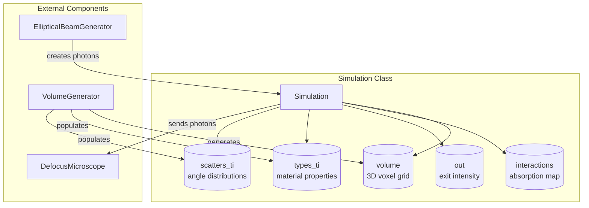
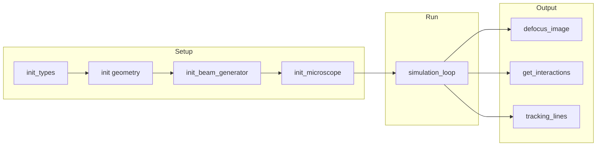
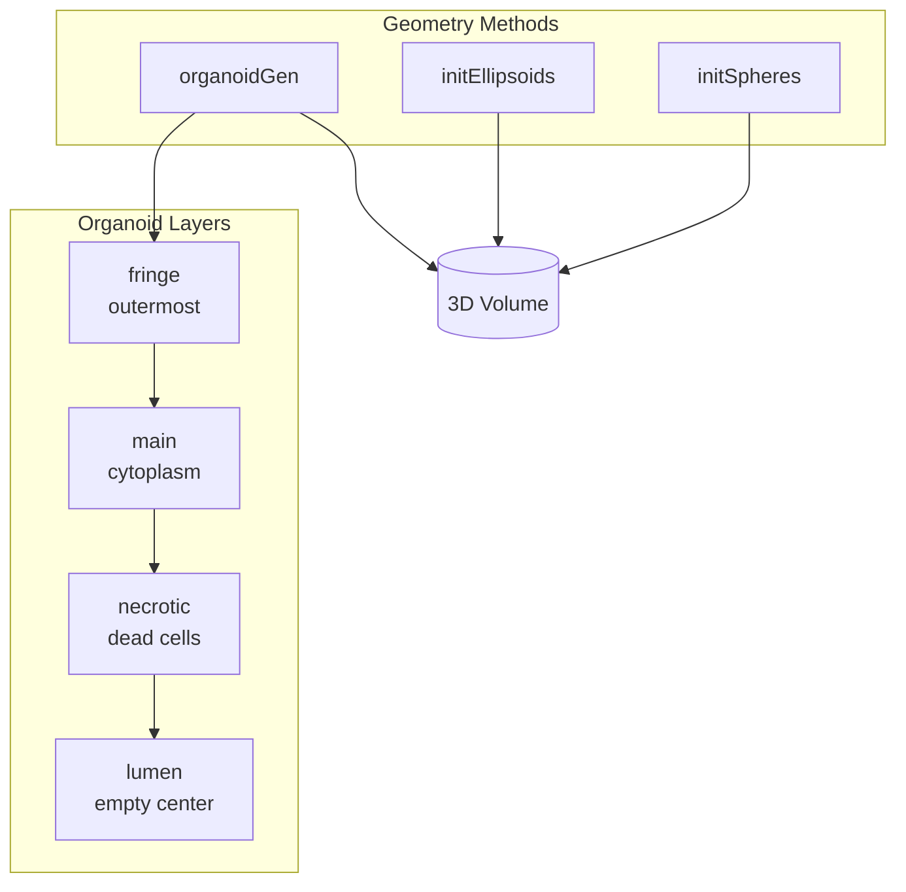
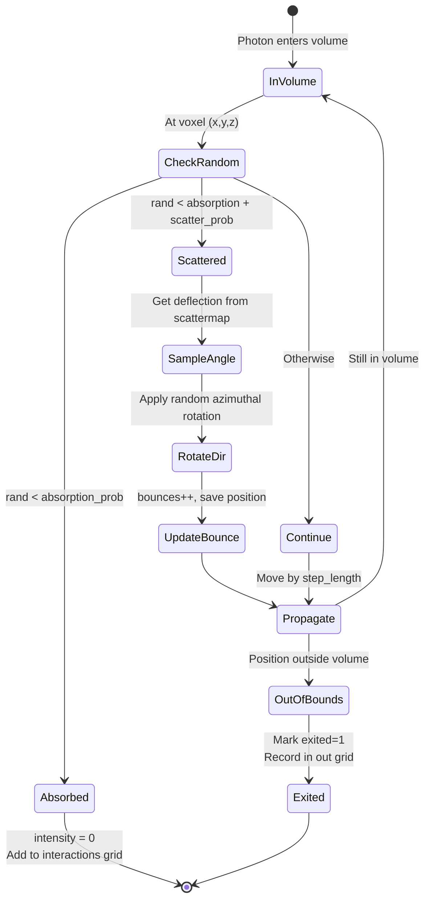
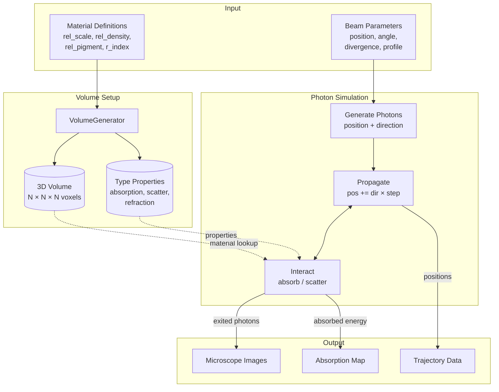

# Simulation.py Summary

## Overview

[simulation.py](simulation.py) implements a GPU-accelerated Monte Carlo photon transport simulation using the Taichi framework. It models light propagation through 3D volumes containing biological structures (organoids, cells) with different material properties, simulating absorption, scattering, and imaging through virtual microscopes.

## Architecture

### Component Overview

### Main Class: `Simulation`

The `@ti.data_oriented` decorated class manages the entire simulation pipeline, from volume generation to photon tracking to microscope image formation.

**Key Initialization Parameters** ([simulation.py:13](simulation.py#L13)):
- `N` - Grid resolution (default 128³ voxels)
- `wavelength` - Light wavelength in μm (default 0.65)
- `n_photons` - Total photons to simulate
- `batch_size` - Photons per batch to manage VRAM

**Core Data Structures**:
- `volume` - 3D grid storing material type IDs (uint16)
- `interactions` - Accumulated absorption energy per voxel
- `out` - Exit intensity map
- `types_ti` - Material properties table (absorption, scattering, refraction)
- `scatters_ti` - Scattering angle distributions per material

## Workflow

### 1. Material Type Initialization

**`init_types(types, scatter_prec)`** ([simulation.py:35](simulation.py#L35)):
- Initializes the `VolumeGenerator` with material definitions
- Each material has: relative scale, density, pigment, and refractive index
- Creates scattering lookup tables with specified precision

### 2. Geometry Definition

Three methods for creating 3D structures:

**`initSpheres(spheres)`** ([simulation.py:47](simulation.py#L47)):
- Creates multi-layered spherical structures

**`initEllipsoids(ellipsoids)`** ([simulation.py:83](simulation.py#L83)):
- Creates arbitrarily oriented ellipsoids with full 3D rotation control
- Supports custom axis orientations via `axis1_dir` and `axis2_dir` vectors
- Enables multi-layer structures (e.g., nucleus inside cytoplasm)

**`organoidGen(...)`** ([simulation.py:52](simulation.py#L52)):
- Convenience method for biological organoid structures
- Generates concentric ellipsoid layers: fringe → main → necrotic → lumen
- Pre-configured with typical biological material properties

### 3. Beam Configuration

**`init_beam_generator(...)`** ([simulation.py:169](simulation.py#L169)):
- Sets up an `EllipticalBeamGenerator` for illumination
- Controls beam geometry (position, angle, divergence)
- Supports elliptical beam profiles with Gaussian distributions

### 4. Photon Simulation Loop

**`simulation_loop(max_steps, step_length, track, n_tracked)`** ([simulation.py:196](simulation.py#L196)):

```mermaid
flowchart TB
    START([Start]) --> RESET[Reset microscope images]
    RESET --> CHECK{photons_left > 0?}

    CHECK -->|Yes| BATCH[Calculate batch size<br/>min&#40;photons_left, batchsize&#41;]
    BATCH --> INIT[init_photons<br/>Generate positions & directions]
    INIT --> TRACK{First batch &<br/>tracking enabled?}

    TRACK -->|Yes| INITTRACK[init_tracking]
    TRACK -->|No| RUN
    INITTRACK --> RUN

    RUN[run_simulation<br/>propagate + interact loop]
    RUN --> NUMPY[to_numpy<br/>Transfer to CPU]
    NUMPY --> MICRO[Add photons to<br/>all microscopes]
    MICRO --> CHECK

    CHECK -->|No| END([End])
```

The main simulation pipeline runs in batches:

1. **Batch Management**: Processes photons in chunks to avoid VRAM overflow
2. **Photon Generation** ([simulation.py:231](simulation.py#L231)): Creates photon arrays with positions/directions from beam generator
3. **Propagation & Interaction Loop** ([simulation.py:410](simulation.py#L410)):
   - **Propagate**: Move photons along their direction vectors ([simulation.py:276-314](simulation.py#L276-L314))
   - **Interact**: Handle absorption/scattering in the volume ([simulation.py:317-407](simulation.py#L317-L407))
4. **Microscope Accumulation**: Add photons to virtual detector images

### 5. Photon Interactions

**`_interact_photons(...)`** ([simulation.py:318](simulation.py#L318)) - Taichi kernel:

For each photon at position (x,y,z):
1. **Absorption Check**: Random value < absorption probability → photon absorbed, intensity added to `interactions[x,y,z]`
2. **Scattering Event**: Sample deflection angle from material's scattering distribution
   - Construct orthonormal basis around current direction
   - Apply deflection angle with random azimuthal rotation
   - Update direction vector and bounce counter
3. **Exit Detection**: Track when photons leave the volume and record exit positions in `out` array

### 6. Microscope Integration

**`init_microscope(...)`** ([simulation.py:422](simulation.py#L422)):
- Creates `DefocusMicroscope` instances observing different faces
- Configures optical parameters (NA, magnification, sensor properties)

**`defocus_image(i)`** ([simulation.py:469](simulation.py#L469)):
- Retrieves accumulated image from microscope `i` after simulation completes

### 7. Optional Trajectory Tracking

**`init_tracking(n_tracked, steps)`** ([simulation.py:266](simulation.py#L266)):
- Records positions of first `n_tracked` photons at each step
- Enables visualization with `tracking_lines()` ([simulation.py:448](simulation.py#L448))

## Key Technical Details

- **GPU Acceleration**: All compute-intensive operations use Taichi kernels for parallel execution
- **Memory Management**: Uses `ti.ndarray` instead of fields for photon data to enable batch processing
- **Scattering Physics**: Implements realistic angle-dependent scattering via pre-computed lookup tables
- **Multi-microscope**: Supports simultaneous observation from multiple viewpoints

## Data Flow

